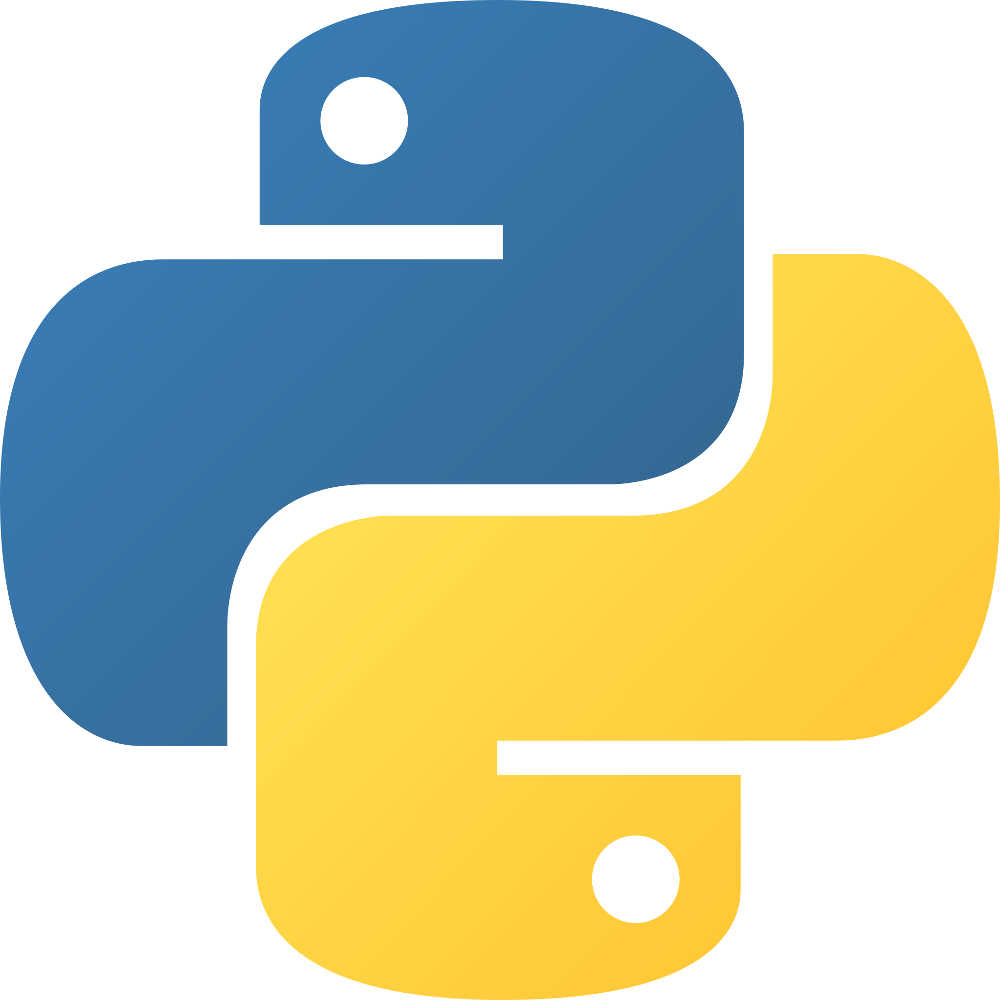

## *Hello! I am `Haridev`👋.*
I am a self-taught full stack developer from Kerala, India.

### **About Me**

- 💪 2+ years of experience in *Django, Flask, Flutter & Vue.js*

- 📈 Built [My KTU Official](https://play.google.com/store/apps/details?id=com.hddevs.ktu_app), [Bulk Square-Fit](https://haridev.me/bulk-squarefit/) & more.

 

    
    
    
    
    
    
    
    
    
    
    
    

 

|  |  |
|    :-----:    |    :-----:    |
|  |  |
<!--
**gharidev/gharidev** is a ✨ _special_ ✨ repository because its `README.md` (this file) appears on your GitHub profile.

Here are some ideas to get you started:

- 🔭 I’m currently working on ...
- 🌱 I’m currently learning ...
- 👯 I’m looking to collaborate on ...
- 🤔 I’m looking for help with ...
- 💬 Ask me about ...
- 📫 How to reach me: ...
- 😄 Pronouns: ...
- ⚡ Fun fact: ...
-->
